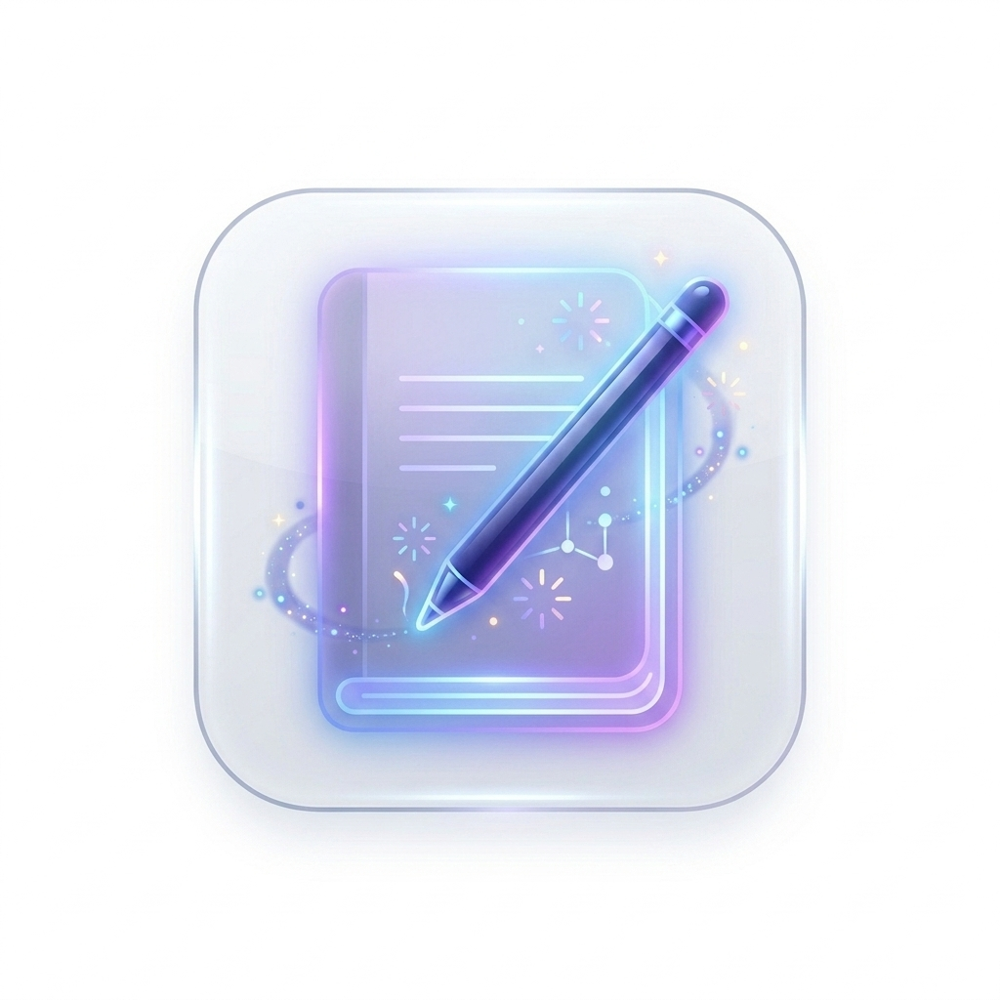
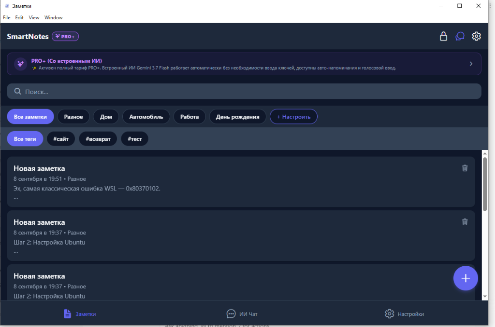
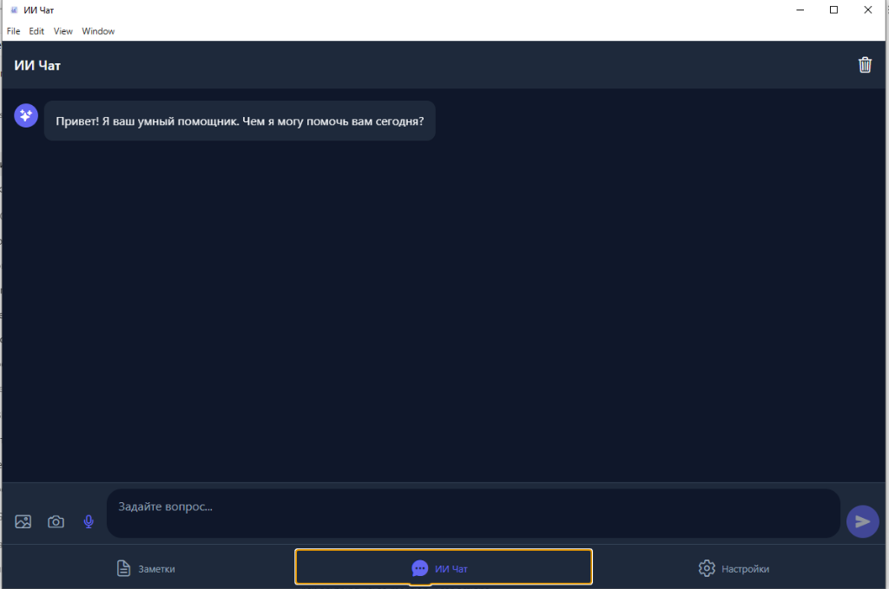

# 🧠 SmartNotes.AI

  

  <b>Умное приложение для заметок с искусственным интеллектом, голосовым вводом и облачной синхронизацией.</b> 
  Доступно для <b>Android</b>, <b>Linux</b> и <b>Windows</b>!

  
  
  
  

---

## 📱 Скачать для Android

Версия для Android уже опубликована и доступна для скачивания:

* 📲 **[Установить из RuStore (Официально)](https://www.rustore.ru/catalog/app/com.andrey.smartnotes)** — рекомендуемый способ с автоматическими обновлениями.
* 📦 **[Скачать прямой файл APK (v1.0.1)](https://github.com/andreykz520-lang/smartnotes-app/releases/tag/v1.0.1)** — прямая установка без магазина.

---

## 💻 Скачать для Компьютера (Linux / Windows)

Все версии скомпилированы и готовы к запуску. Загрузить их можно со страницы [Релизов (GitHub Releases)](https://github.com/andreykz520-lang/smartnotes-app/releases/tag/v1.0.1):

| Платформа | Формат | Ссылка на скачивание | Инструкция по запуску |
| :--- | :--- | :--- | :--- |
| **Linux (Любой)** | `.AppImage` | [SmartNotes.AI-1.0.1.AppImage](https://github.com/andreykz520-lang/smartnotes-app/releases/download/v1.0.1/SmartNotes.AI-1.0.1.AppImage) | `chmod +x SmartNotes.AI-1.0.1.AppImage && ./SmartNotes.AI-1.0.1.AppImage` |
| **Linux (Ubuntu / Debian / Mint)** | `.deb` | [smartnotesapp_1.0.1_amd64.deb](https://github.com/andreykz520-lang/smartnotes-app/releases/download/v1.0.1/smartnotesapp_1.0.1_amd64.deb) | `sudo dpkg -i smartnotesapp_1.0.1_amd64.deb` |
| **Linux (Snap)** | `.snap` | [smartnotesapp_1.0.1_amd64.snap](https://github.com/andreykz520-lang/smartnotes-app/releases/download/v1.0.1/smartnotesapp_1.0.1_amd64.snap) | `sudo snap install --dangerous smartnotesapp_1.0.1_amd64.snap` |
| **Windows** | `.exe` | [SmartNotes.AI.Setup.1.0.1.exe](https://github.com/andreykz520-lang/smartnotes-app/releases/download/v1.0.1/SmartNotes.AI.Setup.1.0.1.exe) | Скачать и запустить установщик |

---

## ✨ Основные возможности

- 🤖 **Встроенный ИИ-помощник:** структурирование мыслей, генерация идей, исправление текста и суммаризация длинных заметок.
- 🎙️ **Голосовой ввод:** мгновенная диктовка мыслей на ходу.
- ☁️ **Синхронизация:** ваши заметки всегда под рукой — на компьютере и смартфоне.
- 📂 **Категории и теги:** удобный поиск и фильтрация информации.
- 🌙 **Современный интерфейс:** поддержка светлой и темной темы.

---

## 📸 Скриншоты

  
  

---

## 🤝 Поддержка и обратная связь

Если у вас возникли вопросы, предложения или идеи по развитию проекта:
- Оставляйте отзывы на странице [RuStore](https://www.rustore.ru/catalog/app/com.andrey.smartnotes)
- Создавайте темы в [GitHub Issues](https://github.com/andreykz520-lang/smartnotes-app/issues)
